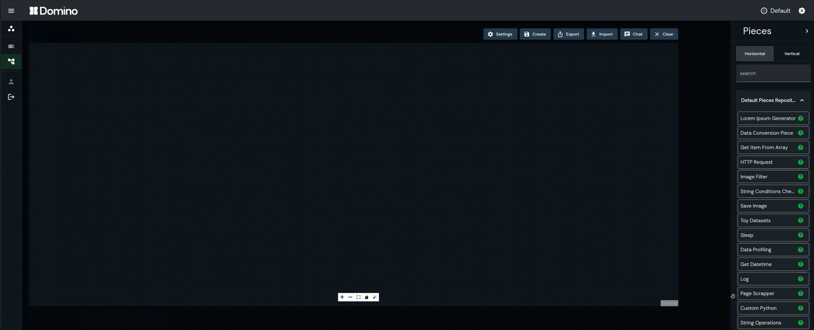

# LLM Inference — SPICE Pipeline Composer



A conversational AI service that translates natural language into executable [Domino](https://github.com/Tauffer-Consulting/domino) data processing workflows. Users describe what they want to do with their data; the system figures out the steps and wires them together.

This is a standalone service that is run as a separate API. It needs to be run together with the modified implementation of Domino done by IISAS.

## How it works

Three LLM agents collaborate in a pipeline:

1. **Conversationist** — Gathers requirements through dialogue. Asks clarifying questions until it has a goal, data source, and output destination. Never infers or invents steps.
2. **Builder** — Maps the user's description to a sequence of available Domino pieces fetched from the database.
3. **Composer** — Fills in piece arguments based on the user's inputs, producing a complete workflow configuration.

The final output is a React Flow–compatible JSON structure ready for the Domino UI.

```
User chat
   ↓
Conversationist  (requirement extraction)
   ↓
Builder          (workflow sequencing + piece matching)
   ↓
Composer         (argument configuration)
   ↓
Workflow JSON    (nodes, edges, piece configs)
```

## Project structure

```
.
├── app.py                      # FastAPI service — /chat endpoint (port 6969)
├── local_testing.py            # Local test harness
├── docker-compose.yml
├── Dockerfile
├── .env.example                # Required environment variables
├── utils/
│   ├── prompts.py              # System prompts for all three agents
│   ├── query_db.py             # PostgreSQL queries for Domino pieces
│   ├── workflow_transform.py   # Builds Domino workflow JSON from agent output
│   └── utils.py
└── tools/
    ├── tool_definitions.py     # LLM tool/function schemas
    └── tool_functions.py       # Tool implementations + agent orchestration
```

## Requirements

- Python >= 3.12
- An OpenAI-compatible LLM API
- PostgreSQL database with Domino schema

## Setup

Copy `.env.example` to `.env` and fill in the values:

```env
# Docker network names (for compose deployments)
DOMINO_NETWORK=
POSTGRES_NETWORK=

# Optional — enables bearer token auth on /chat
CHAT_APP_TOKEN=

# LLM backend (any OpenAI-compatible API)
LLM_BASE_URL=
LLM_API_KEY=

# PostgreSQL connection
DOMINO_DB_USER=
DOMINO_DB_PASSWORD=
DOMINO_DB_HOST=
DOMINO_DB_PORT=
DOMINO_DB_NAME=
```

## Running

### Docker

```bash
docker-compose up
```

The service starts on port **6969**.

### Local

```bash
pip install fastapi uvicorn openai "polars[database]" connectorx pydantic
uvicorn app:app --host 0.0.0.0 --port 6969
```

## API

### `POST /chat`

```json
{
  "messages": [
    {"role": "user", "content": "build a workflow that preprocesses images and trains a classifier"}
  ],
  "workspace_id": 1
}
```

If `CHAT_APP_TOKEN` is set, include `Authorization: Bearer <token>`.

**Response**

```json
{
  "message": "Here is the workflow I built...",
  "workflow": { ... }   // present only when a workflow was successfully composed
}
```

The `workflow` field contains the full React Flow node/edge structure expected by the Domino UI.

## Local testing

`local_testing.py` runs a single test conversation against a local LLM endpoint:

```bash
python local_testing.py
```

Edit the script to change the test prompt or endpoint URL.
